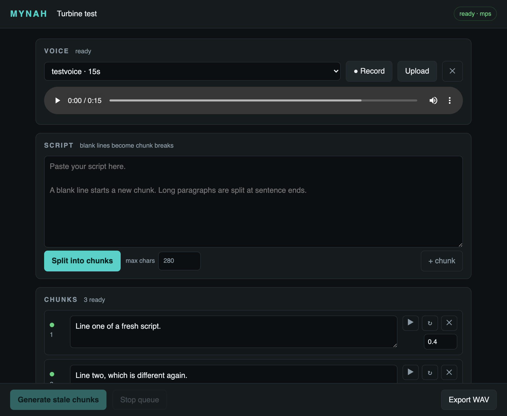

# mynah

Self-hosted voice cloning TTS. Clone a voice from a recording, paste a script,
and generate it chunk by chunk — so fixing one bad line costs one line, not the
whole take.



Runs entirely on your own machine. Nothing is uploaded anywhere.

## Why

Most local TTS front-ends regenerate everything when you change anything. On a
laptop that means waiting minutes because one sentence came out wrong.

mynah names every rendered take after a hash of the things that determine how it
sounds — its text, the voice, the sampling parameters. So:

- Editing one line marks **only that line** stale.
- Re-rendering it never touches the others.
- Changing your mind back restores the earlier take instantly, because the file
  is still there under the same name.
- The pause after a chunk is *not* part of the hash, since silence is added at
  export time. Retiming costs nothing.
- Neither is the project. Two projects that speak the same line in the same
  voice share one file on disk.

There is no "rendered" flag to get out of sync with the disk. The filename is
the record.

## Requirements

- Python 3.10–3.12 (tested on 3.12)
- ~3 GB free disk for the model; 16 GB RAM is comfortable, 8 GB is not
- Apple silicon (Metal), an NVIDIA GPU (CUDA), or CPU if you are patient

The model is [Chatterbox Turbo](https://github.com/resemble-ai/chatterbox) by
Resemble AI — a 302M-parameter transformer with a 266M vocoder, ~746M total.
It downloads on first run (~2.85 GB) and takes about **4.4 GB** on the GPU
while generating, measured on an M1 Pro.

## Install

```bash
git clone https://github.com/YOU/mynah && cd mynah
python3.12 -m venv .venv && source .venv/bin/activate
pip install -r requirements.txt
```

## Run

```bash
python run.py
```

Opens <http://localhost:8765>. The first launch downloads the model, which takes
a few minutes; the page says `loading model` until it is usable.

Bind elsewhere with `--host 0.0.0.0 --port 9000`. The default stays on loopback
on purpose — there is no authentication, so anything that can reach the port can
use your microphone recordings and your GPU.

### If it does not start

Almost always the wrong interpreter. `python` is whatever your shell resolves it
to, which on a pyenv or conda machine is frequently not the environment you
installed into. mynah checks this before doing anything else and, if it can find
a Python on your machine that does have what it needs, prints the exact command:

```
mynah needs Python 3.10 or newer, but this is 3.8.11:
  /Users/you/.pyenv/versions/3.8.11/bin/python3

This one has everything mynah needs:
  /Users/you/.pyenv/versions/3.12.4/bin/python run.py
```

It also refuses to start on a port that is already in use, rather than printing
a URL that goes nowhere.

## Using it

0. **Project.** The picker in the header lists your projects; `+ New` starts
   another, the title box renames the current one, `✕` deletes it. The URL
   carries `?p=<id>`, so a reload or a second tab lands on the same project.
1. **Voice.** Record straight from the browser, or upload a clip. It needs
   **more than 5 seconds** of clean speech — the timer turns green when you are
   past it. Any format ffmpeg reads will do.
2. **Script.** Paste it and press *Split into chunks*. Blank lines become chunk
   breaks; anything longer than the character limit is split at sentence ends.
3. **Generate.** *Generate stale chunks* queues everything unrendered. ↻ on a
   row re-rolls just that row — useful when a take is fine except for one word.
4. **Export.** Stitches the takes together with each chunk's trailing pause and
   downloads a WAV. At this step each take is trimmed of the model's own
   leading and trailing silence, loudness-matched to the others, and given an
   8 ms fade at each end — so a 0.4 s pause is 0.4 s, and takes that came out
   a couple of dB apart do not announce the join.

### Getting output that does not sound choppy

Prosody restarts at every chunk boundary — the model has no idea what came
before. Two consequences worth knowing:

- **Prefer longer chunks.** The default 280-character limit is a reasonable
  balance. Dropping it to 80 will make every sentence sound like it is starting
  a new paragraph.
- **Let punctuation do the work.** A comma inside one chunk produces a far more
  natural pause than splitting into two chunks with a gap between them.

Use the per-chunk pause for real beats between ideas, not for breath.

## Layout

```
mynah/
  engine.py   model load, voice compilation, generation
  jobs.py     app state and the single-threaded render queue
  store.py    project, chunks, fingerprints, script splitting
  audio.py    decode, loudness-normalise, stitch
  server.py   HTTP API
  web/        the page
data/
  projects/<id>/project.json   one file per project
  voices/<id>/                 reference.wav, voice.pt, meta.json
  takes/<fingerprint>.wav      shared by every project (gitignored, all of it)
```

The whole UI reads one `GET /api/state`, polled. There is no client-side copy of
the project to drift out of sync.

## Notes

- **Output carries a watermark.** Chatterbox applies Resemble's Perth
  watermark to everything it generates. That is upstream behaviour, not
  something mynah adds or can turn off.
- **Turbo ignores `exaggeration` and `cfg_weight`.** The base Chatterbox model
  takes them; Turbo logs a warning and drops them. They are deliberately not
  exposed here rather than offered as controls that do nothing.
- **Apple silicon fix.** The model's built-in loudness normaliser returns
  float64, which Metal refuses, and voice compilation fails on it. mynah does
  the same normalisation itself in float32 and disables the model's — see
  `audio.to_wav`.
- **The NumPy pin is load-bearing.** numba (via librosa) rejects NumPy 2.4+. A
  fresh install without the pin in `requirements.txt` resolves to something
  newer and every import of the model fails.
- **Only the files Turbo reads are downloaded.** Upstream's loader fetches
  every `.safetensors` in the repo, including a 1 GB vocoder the Turbo class
  never opens. `engine.MODEL_FILES` lists what is actually needed; if that
  list ever goes stale against upstream, it falls back to their loader.
- **float16 does not work on Metal.** Tried: the model mixes dtypes in at
  least one `add` and MPSGraph aborts the process rather than raising. It
  runs in float32 everywhere.
- **Upgrading from a single-project `data/project.json`** is automatic: on
  first start it becomes the first project and the old file is renamed
  `project.json.migrated`, not deleted.
- Only one generation runs at a time. A GPU has one queue anyway; running two
  mostly gives you two slow ones.

## Tests

Everything that does not need the model — splitting, fingerprints, chunk
status, the stitch's pause accuracy and loudness matching — is covered:

```bash
python -m unittest discover tests
```

## Clone responsibly

Clone your own voice, or one you have permission to use. Cloning someone's voice
to make them appear to say things they did not is impersonation, and in many
places illegal.

## Licence

MIT — see [LICENSE](LICENSE). The model weights are Resemble AI's and carry
their own terms.
