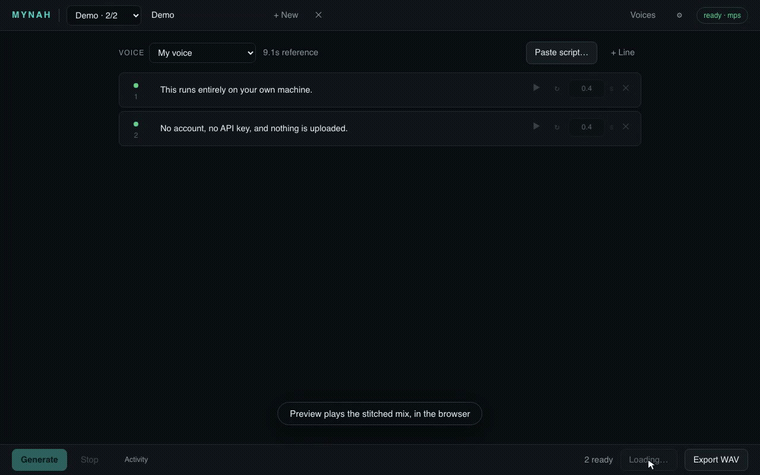
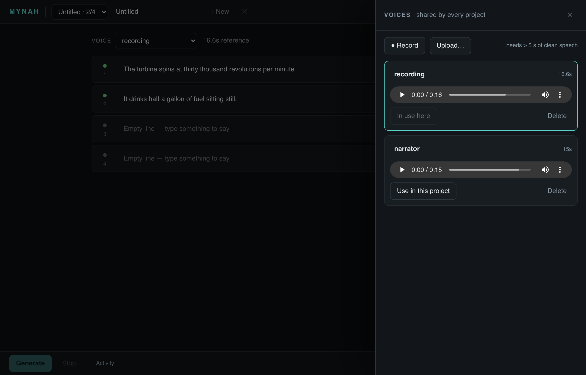

# mynah

Self-hosted voice cloning TTS. Clone a voice from a recording, paste a script,
and generate it chunk by chunk — so fixing one bad line costs one line, not the
whole take.



Runs entirely on your own machine. Nothing is uploaded anywhere; there is no
account, no API key, and no login to the model host.

[Full demo with sound (~40s)](docs/demo.mp4) — writing a script, generating,
listening back, then changing one line and re-rolling only that line.

## Quick start

With [uv](https://docs.astral.sh/uv/) (it picks a compatible Python — downloading
one if needed — makes the venv, installs everything, runs):

```bash
git clone https://github.com/seena18/mynah && cd mynah
uv run run.py
```

Opens <http://localhost:8765>. The first start downloads the model — **~3 GB**,
shown with a running total in the page header — and takes a few minutes; every
start after that is about 25 seconds to a ready model.

To fetch the weights ahead of time (say, before going somewhere with bad wifi):

```bash
uv run run.py --download
```

### With pip instead

```bash
python3.12 -m venv .venv && source .venv/bin/activate
pip install -r requirements.txt
pip install --no-deps "chatterbox-tts @ git+https://github.com/resemble-ai/chatterbox@ed27b95"
python run.py
```

Two steps because chatterbox's own package metadata pins `numpy<1.26`, which has
no wheel for Python 3.12 — a plain `pip install` tries to build NumPy 1.25 from
source and fails. The code runs fine on NumPy 2.x; `requirements.txt` lists
chatterbox's real dependencies itself, and `--no-deps` stops pip re-reading the
stale pin. (`uv run` does the same thing through an override in
`pyproject.toml`.)

## Why

Most local TTS front-ends regenerate everything when you change anything. On a
laptop that means waiting minutes because one sentence came out wrong.

mynah names every rendered take after a hash of the things that determine how it
sounds — its text, the voice, the sampling parameters. So:

- Editing one line marks **only that line** stale.
- Re-rendering it never touches the others.
- Changing your mind back restores the earlier take instantly, because the file
  is still there under the same name.
- The pause after a chunk is *not* part of the hash, since silence is added at
  export time. Retiming costs nothing.
- Neither is the project. Two projects that speak the same line in the same
  voice share one file on disk.

There is no "rendered" flag to get out of sync with the disk. The filename is
the record.

## Requirements

- Python 3.10–3.12 (3.12 is what is tested; `uv run` handles this for you)
- `git` on PATH (the model code is installed from a pinned commit)
- ~4 GB free disk: 3 GB of weights plus the Python environment
- 16 GB RAM is comfortable, 8 GB is not — the model takes ~4.4 GB on the GPU
  while generating
- Apple silicon (Metal), an NVIDIA GPU (CUDA), or CPU if you are patient —
  see *Platforms* below for what was actually measured.

The model is [Chatterbox Turbo](https://github.com/resemble-ai/chatterbox) by
Resemble AI — a 302M-parameter transformer with a 266M vocoder, ~746M total,
MIT-licensed like its code. `ffmpeg` is bundled through `imageio-ffmpeg`, so
there is nothing to install with a package manager.

## Platforms

Each row is a fresh `git clone` and the quick start above, with an empty model
cache, on real hardware. "Per chunk" is a ~3-second line of speech.

| Platform | Install, incl. 3 GB weights | Model load | Per chunk | Peak GPU memory |
|---|---|---|---|---|
| macOS, M1 Pro 16 GB (Metal) | 91 s | ~25 s | 5–12 s | 4.4 GB |
| WSL2 Ubuntu 22.04, RTX 4080 SUPER (CUDA) | 161 s | 8 s | 0.4–1.0 s | 4.8 GB |
| Windows 11, RTX 4080 SUPER (CUDA) | 100 s, + 60 s for the CUDA torch | 10 s | 0.5–1.0 s | 4.8 GB |

- **Windows gets CUDA through the PyTorch index**, not PyPI — PyPI's Windows
  torch wheel is CPU-only. `uv run` does this by itself (see
  `[tool.uv.sources]` in `pyproject.toml`); with pip, run the one extra line
  noted in `requirements.txt` first.
- **Linux needs nothing extra**: the PyPI wheel already bundles CUDA. Inside
  WSL2 the GPU is visible as long as the Windows NVIDIA driver is installed;
  no CUDA toolkit in the distro is required.
- **CPU-only** is untested and will be slow — expect minutes per chunk.

## Using it

The page is the list of lines. Everything else opens over it and closes back to
where you were.

0. **Project.** The picker in the header switches projects; `+ New` starts
   another, the title box renames the current one, `✕` deletes it. The URL
   carries `?p=<id>`, so a reload or a second tab lands on the same project.
1. **Voice.** *Voices* in the header (or *Manage voices…* in the picker) opens
   the voices drawer. Record straight from the browser or upload a clip — it
   needs **more than 5 seconds** of clean speech, and the timer turns green
   when you are past it. Each voice is a card: rename it in place, preview the
   reference, *Use in this project*. Voices are shared by every project.
2. **Script.** *Paste script…* opens a sheet. Blank lines become line breaks;
   anything longer than the character limit is split at sentence ends. Or add
   lines one at a time with *+ Line*.
3. **Generate.** *Generate* (or `⌘`/`Ctrl` + `Enter`) queues every line that is
   stale. ↻ on a line re-rolls just that line — for when a take is fine except
   for one word. Hover a line to see its controls.
4. **Preview.** *▶ Preview* plays the same stitched mix in the browser — no
   download — and highlights the line currently sounding as it plays, so you
   hear the whole thing flow together rather than line by line. Enabled under
   the same condition as Export: every non-empty line has to be `ready`.
5. **Export.** Stitches the takes together with each line's trailing pause and
   downloads a WAV. At this step each take is trimmed of the model's own
   leading and trailing silence, loudness-matched to the others, and given an
   8 ms fade at each end — so a 0.4 s pause is 0.4 s, and takes that came out
   a couple of dB apart do not announce the join. Preview and Export always
   hear the current state of the project — nothing is cached between clicks.

Sampling parameters live behind ⚙; *Activity* in the footer shows the log.



### Getting output that does not sound choppy

Prosody restarts at every chunk boundary — the model has no idea what came
before. Two consequences worth knowing:

- **Prefer longer chunks.** The default 280-character limit is a reasonable
  balance. Dropping it to 80 will make every sentence sound like it is starting
  a new paragraph.
- **Let punctuation do the work.** A comma inside one chunk produces a far more
  natural pause than splitting into two chunks with a gap between them.

Use the per-chunk pause for real beats between ideas, not for breath.

## Speed, honestly

Measured on the RTX 4080 SUPER, one ~6-second line, warm:

| Stage | Time | Share |
|---|---|---|
| Transformer decode (one step per speech token) | 0.86 s | 89 % |
| Vocoder | 0.09 s | 9 % |
| Watermark, file write | 0.01 s | 1 % |
| **Total** | **0.97 s** | 6× realtime |

The decode is bound by per-step launch overhead, not arithmetic. Two things
that sound like they should help were measured and do not:

- **Mixed precision** — bf16 and fp16 autocast both run *slower* (1.20 s and
  1.24 s): casting adds per-op overhead to a loop that is already
  overhead-bound. On Metal, `.half()` aborts the process outright.
- **A second model instance** — two generating at once each take 2.0 s.
  Aggregate throughput is unchanged; one decode already saturates the GPU.

What actually saves time:

- **The take cache.** A line whose text, voice and parameters have not changed
  is never regenerated. This is the single largest saving in real use.
- **Longer lines.** Every line pays the fixed cost of a fresh decode; fewer
  lines is faster *and* smoother.
- **Stop that stops.** *Stop* aborts the line being generated at its next
  decode step, not after the line completes.
- **Hardware.** The 4080 SUPER is roughly ten times an M1 Pro per line. On
  Apple silicon, generation also suffers badly when the machine is swapping —
  a 4.4 GB model paged in and out turned an 11 s decode into 45 s here.

## Where things live

```
mynah/
  engine.py   weights, model load, voice compilation, generation
  jobs.py     app state and the single-threaded render queue
  store.py    projects, chunks, fingerprints, script splitting
  audio.py    decode, loudness-normalise, stitch
  server.py   HTTP API
  web/        the page
data/                                (gitignored, all of it)
  projects/<id>/project.json         one file per project
  voices/<id>/                       reference.wav, voice.pt, meta.json
  takes/<fingerprint>.wav            shared by every project
```

The whole UI reads one `GET /api/state?p=<id>`, polled. There is no client-side
copy of the project to drift out of sync.

### The weights

They land in the standard Hugging Face cache (`~/.cache/huggingface/hub`, or
wherever `HF_HOME` points) and are shared with anything else on the machine
that uses the same model. Only the files Turbo reads are fetched — 2.99 GB, not
the 4 GB upstream's loader pulls, which includes a vocoder it never opens.

**Offline or firewalled?** Put these nine files from
[ResembleAI/chatterbox-turbo](https://huggingface.co/ResembleAI/chatterbox-turbo/tree/main)
in a folder and point `MYNAH_MODEL_DIR` at it; nothing will be downloaded:

```
t3_turbo_v1.safetensors   s3gen_meanflow.safetensors   ve.safetensors   conds.pt
tokenizer_config.json     vocab.json   merges.txt   special_tokens_map.json   added_tokens.json
```

## Notes

- **Output carries a watermark.** Chatterbox applies Resemble's Perth
  watermark to everything it generates. That is upstream behaviour, not
  something mynah adds or can turn off.
- **`setuptools<81` is load-bearing.** The watermarker package imports
  `pkg_resources`, which setuptools removed in 81 — and `uv`/`venv`
  environments do not include setuptools at all. Without the pin the import
  fails silently and model load dies with `'NoneType' object is not callable`.
  Both `requirements.txt` and `pyproject.toml` carry it.
- **No Hugging Face login is needed** — but upstream's own loader asks for one
  anyway (it passes `token=True` for a public repo). mynah downloads the files
  itself, anonymously, and never calls that loader.
- **Turbo ignores `exaggeration` and `cfg_weight`.** The base Chatterbox model
  takes them; Turbo logs a warning and drops them. They are deliberately not
  exposed here rather than offered as controls that do nothing.
- **Apple silicon fix.** The model's built-in loudness normaliser returns
  float64, which Metal refuses, and voice compilation fails on it. mynah does
  the same normalisation itself in float32 and disables the model's — see
  `audio.to_wav`.
- **float16 does not work on Metal.** Tried: the model mixes dtypes in at
  least one `add` and MPSGraph aborts the process rather than raising. It
  runs in float32 everywhere.
- **Upgrading from a single-project `data/project.json`** is automatic: on
  first start it becomes the first project and the old file is renamed
  `project.json.migrated`, not deleted.
- **Binding off loopback** (`--host 0.0.0.0`) exposes it to your network with
  no authentication. Anyone who can reach the port can use your microphone
  recordings and your GPU.
- Only one generation runs at a time. A GPU has one queue anyway; running two
  mostly gives you two slow ones.

### If it does not start

Almost always the wrong interpreter. `python` is whatever your shell resolves it
to, which on a pyenv or conda machine is frequently not the environment you
installed into. mynah checks this before doing anything else and, if it can find
a Python on your machine that does have what it needs, prints the exact command:

```
mynah needs Python 3.10 or newer, but this is 3.8.11:
  /Users/you/.pyenv/versions/3.8.11/bin/python3

This one has everything mynah needs:
  /Users/you/.pyenv/versions/3.12.4/bin/python run.py
```

It also refuses to start on a port that is already in use, rather than printing
a URL that goes nowhere. `uv run run.py` sidesteps all of this.

## The demo

`docs/demo.gif` and `docs/demo.mp4` are recorded by driving the real app:

```bash
python run.py                          # in one terminal
uv run --group dev tools/demo.py       # in another
```

Nothing in it is staged. It clicks through a live server, waits on real
generation, and the audio in the video is the WAV that run actually exported.
What is added is presentation: headless Chromium draws no cursor, so one is
injected into the page along with the captions, and the stretches where the
machine is only thinking are timelapsed — by however much it takes to get each
down to a few seconds, so the demo is the same length on a fast machine and a
slow one. Everything else is real time.

It runs on a scratch project and deletes it afterwards, along with only the
takes no other project shares, so your own work is untouched and the next run
still has something real to generate.

## Tests

Everything that does not need the model — splitting, fingerprints, chunk
status, project migration, and the stitch's pause accuracy and loudness
matching — is covered, and runs in CI without torch or weights:

```bash
python -m unittest discover tests
```

## Clone responsibly

Clone your own voice, or one you have permission to use. Cloning someone's voice
to make them appear to say things they did not is impersonation, and in many
places illegal.

## Licence

MIT — see [LICENSE](LICENSE). The Chatterbox code and weights are MIT as well,
© Resemble AI.
