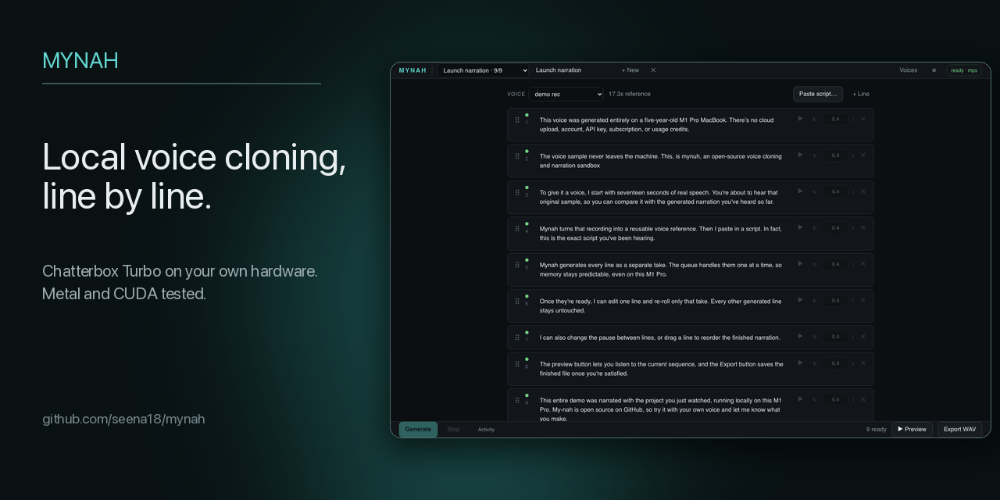

# mynah

Local voice cloning and narration with editable, independently generated lines.
Mynah wraps [Chatterbox Turbo](https://github.com/resemble-ai/chatterbox) in a
small self-hosted interface: record or upload a voice, paste a script, reroll one
bad take, and export the finished WAV.

[](https://github.com/seena18/mynah/releases/download/v1.0.1/mynah-demo-v1.0.1.mp4)

**[Watch the 97-second demo with sound](https://github.com/seena18/mynah/releases/download/v1.0.1/mynah-demo-v1.0.1.mp4)** ·
**[v1.0.1 release](https://github.com/seena18/mynah/releases/tag/v1.0.1)** ·
**[Detailed guide](docs/guide.md)**

Everything runs on your machine. Mynah has no account, API key, usage credits,
or cloud upload. Projects, voice recordings, and generated takes live in the
Git-ignored `data/` directory and are never included in a clone or release.

## Quick start

Install [uv](https://docs.astral.sh/uv/) and Git, then run:

```bash
git clone https://github.com/seena18/mynah
cd mynah
uv run run.py
```

Mynah opens at <http://localhost:8765>. The first launch creates its Python
environment and anonymously downloads the pinned 2.99 GB model checkpoint.
Allow roughly 4 GB of free disk space. Later launches reuse both caches.

To download the weights ahead of time:

```bash
uv run run.py --download
```

A [pip installation path](docs/guide.md#with-pip-instead), offline model setup,
and startup troubleshooting are covered in the [detailed guide](docs/guide.md).

## What it does

1. **Give it a voice.** Record in the browser or upload more than five seconds
   of clean speech. Compiled voices can be reused across projects.
2. **Paste a script.** Blank lines become editable lines; long paragraphs split
   at sentence boundaries.
3. **Generate locally.** A single queue renders lines one at a time so memory
   use remains predictable on laptops.
4. **Fix only what needs fixing.** Edit, reorder, retime, or reroll one line
   without regenerating the rest. Reverting text restores its cached take.
5. **Listen and export.** Preview the stitched sequence with waveform seeking
   and active-line highlighting, then download a loudness-matched WAV.

## Why lines are independent

A take is addressed by a fingerprint of its text, voice, and sampling settings.
Changing one line invalidates only that take. Pauses are added when the project
is stitched, so retiming never triggers synthesis. Identical lines can even
reuse audio across projects.

This matters most on local hardware, where avoiding unnecessary generation is
more useful than hiding the wait behind cloud infrastructure.

## Measured generation speed

Warm generation of one approximately eight-second line:

| Hardware | Speech produced | Generation time | Speed |
|---|---:|---:|---:|
| M1 Pro, 16 GB, Metal | 8.04 s | 17.77 s | 0.45× realtime |
| RTX 4080 SUPER, WSL2, CUDA | 8.08 s | 1.36 s | 5.94× realtime |

The M1 is slower than realtime, but completes the full workflow locally without
running out of memory. Generation is stochastic, so timings vary with the text
and resulting speech length.

Fresh installations and the real upload → generate → edit → reroll → preview →
export workflow were also validated on:

- macOS on an M1 Pro using Metal
- Windows 11 on an RTX 4080 SUPER using CUDA
- WSL2 Ubuntu 22.04 on the same RTX 4080 SUPER

See the [Windows and WSL validation report](docs/platform-validation-2026-09-08.md)
for versions, install timing, memory use, and test scope. CPU-only execution is
available but has not been validated and is expected to be slow.

## Requirements

- Python 3.10–3.12; `uv` selects a compatible interpreter
- Git on `PATH`, because Chatterbox is installed from a pinned commit
- Approximately 4 GB free disk space
- 16 GB RAM recommended
- Apple silicon, an NVIDIA CUDA GPU, or patience for CPU execution

`ffmpeg` is supplied through `imageio-ffmpeg`; no system package is required.
Windows CUDA wheels are selected automatically by the `uv` configuration.

## Data, weights, and networking

A new clone starts with one empty **Untitled** project and no voices. User data
is written beneath `data/`, which is excluded from Git. Model weights are pinned
to the tested checkpoint and stored in the standard Hugging Face cache. No
Hugging Face login is required.

Mynah binds to loopback by default. Running with `--host 0.0.0.0` makes it
reachable on the local network, but the app has no authentication; anyone who
can reach that port can access its projects and use its inference hardware.

## Limitations and responsible use

- Voice quality depends on the reference recording and the generated take.
  Generation is stochastic and sometimes needs a reroll.
- Prosody restarts at every line boundary. Longer, punctuated lines generally
  sound smoother than many short fragments.
- One generation runs at a time.
- Generated audio carries Chatterbox's upstream Perth watermark.
- Clone your own voice or one you have permission to use.

## Documentation

- [Detailed usage, architecture, and troubleshooting](docs/guide.md)
- [Windows and WSL release validation](docs/platform-validation-2026-09-08.md)
- [Contributing](CONTRIBUTING.md)
- [Security policy](SECURITY.md)

## Development

The compiled React frontend is committed, so users do not need Node. For UI
work, run the Python server on port 8765 and Vite separately:

```bash
cd frontend
npm ci
npm run dev
```

Before submitting changes, rebuild the shipped assets and run the automated
suite:

```bash
cd frontend && npm run build && cd ..
MYNAH_BROWSER_TESTS=1 uv run --group dev python -m unittest discover -v tests
```

The current suite contains 56 unit and browser tests. CI also verifies that the
committed frontend matches its React source and that dependencies still resolve.

## License

MIT — see [LICENSE](LICENSE). Chatterbox code and weights are also MIT licensed,
© Resemble AI.
